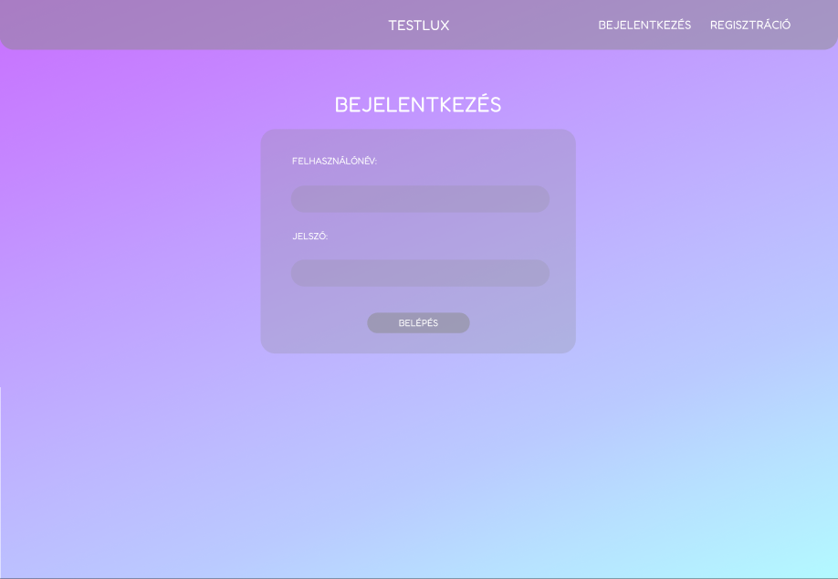

# Funkcionális specifikáció

2.1 Bevezetés

A weboldalunk célja az, hogy különböző tesztek kitöltésével bővíthessék a felhasználók a tudásukat vagy csak szimpla szórakozásból használják ki a weboldal adottságait.
A weboldal megjelenésével, élénk színek használatával szeretnénk ösztönözni az embereket ennek használatára.
Ezáltal elérhető egy bizonyos kompetencia a felhasználók közt.
- regisztráció nem szükséges a kérdőívek kitöltéséhez
- regisztrált felhasználók tudnak kérdőíveket csinálni, amik elérhetőek lesznek a többi ember számára is
- igényes megjelenés

2.2 Feltételek

A weboldal feltétele, hogy html kódon alapuló weblapot kell szerkeszteni. A kinézetett CSS programozási nyelv segítségével kell elérni, míg a funkciók a PHP 
segítégével fognak megtörténni. A felhasználók adatbázisát a phpMyAdmin software segítségével oldanánk meg. Melyet egy projekt menedzser felületen lesz végre hajtva. Ezen project menedzser lesz a Laravel.

2.3 Használati esetek

Vendég:
  - kitöltheti a feltöltött kérdőíveket
  - regisztrálhat kérdezőként, vagy válaszolóként
Felhasználó:
  - létrehozhat kvízeket, és ki is tölthet mások által feltöltött kvízt is

2.4 Forgatókönyvek

Ha kérdezőként regisztrált be a felhasználó, akkor bejelentkezés után létrehozhat új kérdőíveket. Három fajta kérdőívet tud létrehozni: lehet igaz-hamis, szabadválaszos illetve megadott válaszos kérdőív. A felhasználónak van lehetősége válaszolóként regisztrálni, ilyenkor csak kitölteni tudja a már létrehozott kérdőíveket.
A kérdőívek bejelentkezés nélkül is kitölthetőek. 

2.5 Képernyőtervek

  2.5.1 Login
  
  
  
  
  
