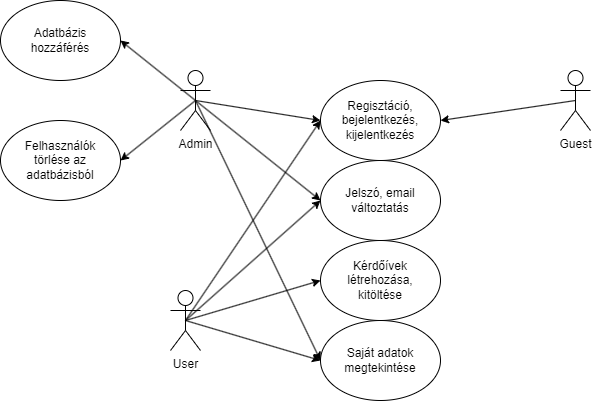
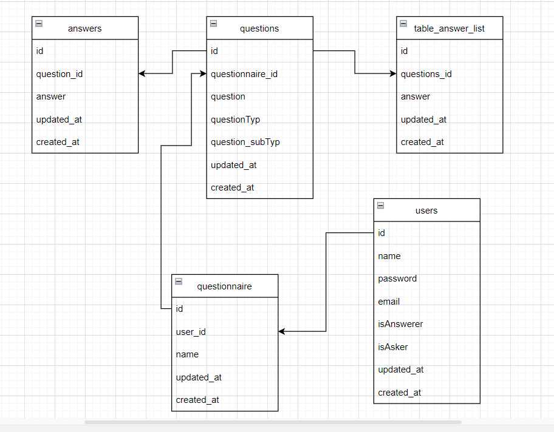

# Rendszerterv

3.1 A rendszer célja

A rendszer célja az, hogy a felhasználók különböző tesztek kitöltésével bővíthessék a tudásukat, versenyezhessenek egymással, vagy csak szimplán szórakoztató jellege miatt használhassák az oldalt. A weboldal igényes, figyelemfelkeltő megjelenésével szeretnénk ösztönözni az embereket ennek használatára. A tesztek kitöltése után pontszámokat lehet gyűjteni, ezáltal elérhető egy bizonyos kompetencia a regisztrált felhasználók közt.

3.2 Projektterv
A projektet weblapon valósítjuk meg, melynek van egyaránt frontend és backend része. Az egyes feladatokat többségében külön emberek végzik. A frontend fejlesztésére HTML-t és CSS alkalmazunk.

  - A frontend fejlesztők célja hogy egy könnyen átlátható, igényes, felhasználóbarát felületet hozzanak létre.
  - A backend fejlesztők feladata, a háttérben zajló folyamatok leprogramozása, JavaScript kód megírása, a program helyes működésének biztosítása, és az eredmény           kiértékelése.

3.3 Üzleti folyamatok modellje

3.4 Követelmények

A weboldal létrehozásához HTML/CSS illetve JavaScriptet és PHP-t használtunk. A felépítés és dizájnolás HTML és CSS implementálásával történik. Az oldal teljes értékű felhasználására elegendő egy egyszerű internetes böngészőt indítanunk. A keretrendszer amit használunk a projekthez a Laravel

3.5 Funkcionális terv
Rendszerszereplők:
  - Felhasználó: kérdezőként és válaszolóként lehet regisztrálni. Kérdezőként létrehozhat új kérdőíveket, emellett kérdőíveket is tud kitölteni. Válaszolóként csak 
    kérdőíveket tud kitölteni.
  - Vendég: kérdőíveket tud kitölteni.

3.6 Fizikai környezet

Az alkalmazás webes platformra készült, de más platformokon is működik. A weboldal igénybe vételéhez csupán egy internetes böngészőre van szükségünk.

  - Van tűzfal a hálózaton, és minden portot engedélyez.
  - Nincsenek megvásárolt komponenseink
  - Fejlesztői eszközök:
    - phpMyAdmin
    - Visual Studio Code
    - Figma
    - Laravel

3.7 Adatbázis terv

3.8 Tesztterv

A teszt elsődleges célja: az eddig meglévő funkcióknak a különböző böngészőkkel való kompatibilitásának tesztelése.

  - Metódusok megfelelően működnek-e
  - Különböző böngészőkkel való tesztelés (Edge, Google Chrome).

3.9 Telepítési terv

Nem szükséges telepítés, böngészőből minden eszközön futtatható.

3.10 Implementációs terv

A Webes felület főként HTML, CSS, és Javascript nyelven fog készülni.	
Ezeket a technológiákat amennyire csak lehet külön fájlokba írva készítjük, és
úgy fogjuk egymáshoz csatolni a jobb átláthatóság érdekében 

3.11 Karbantartási terv

- A weboldal frissítési jogát fenntartjuk.
- Az oldal helyes működésének heti rendszerességgel történő ellenőrzése.
